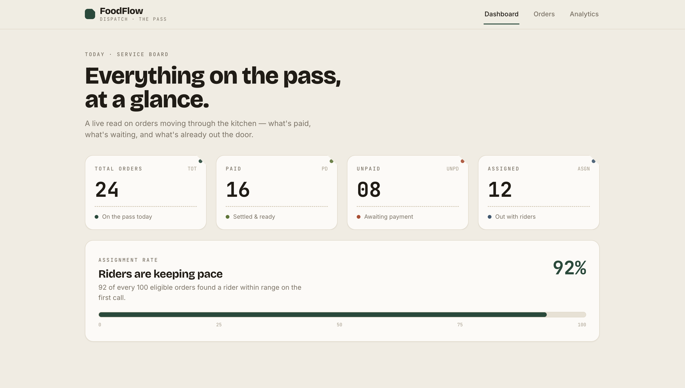
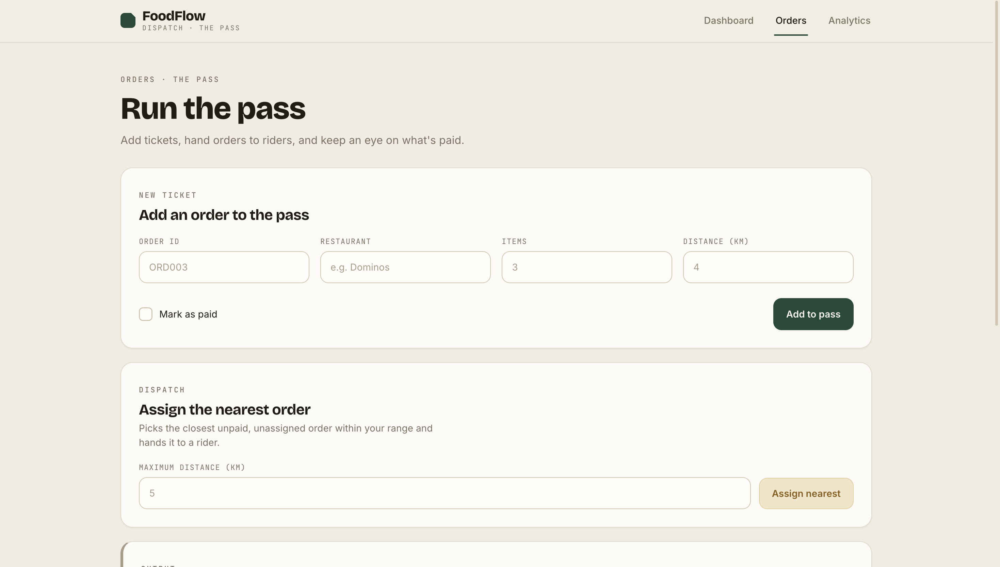
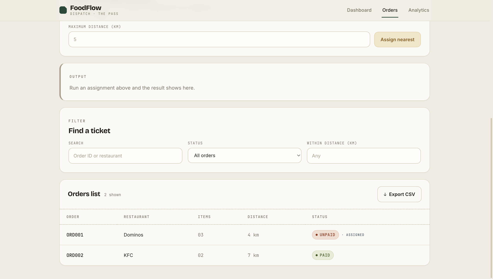
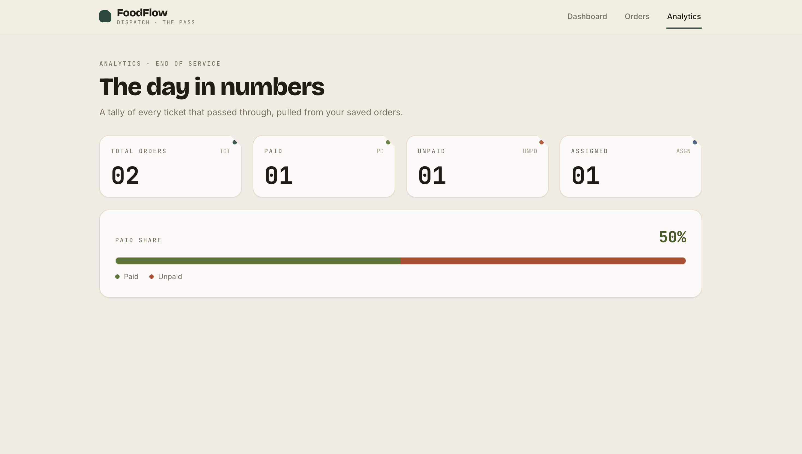

# FoodFlow 🛵

A smart food‑delivery order manager that tracks orders and automatically assigns delivery to the **nearest unpaid order**.

🔗 Live demo: https://food-order-manager.vercel.app/

---

## Project Description

I built FoodFlow as a food‑delivery operations console — the kind of screen a dispatcher would actually keep open all day. The goal was to make it feel like a real product, not a throwaway demo: a clear dashboard, a proper orders screen, and a working "assign the nearest rider" feature with real allocation logic behind it.

FoodFlow is themed around **"the pass"** — the spot in a kitchen where order tickets line up and get called out. Orders show up as little tickets with monospace numbers, so the whole thing reads like a dispatch board instead of a generic admin panel.

You can add orders, view them all, filter them by paid status or distance, and run the **AssignDelivery** feature to hand the closest unpaid order to a rider. Everything you add is saved on the device with the browser's localStorage, so your orders are still there when you reopen the app. It also keeps working with no internet — there's no backend to call, and a banner appears at the top when you go offline.

I built it one layer at a time: first the routing and layout, then the data and the allocation logic, then the screens, and finally the design system that ties it all together. The Git history shows that progression.

---

## Features
- You get a **dashboard** the moment you open the app, with live counts for total, paid, unpaid, and assigned orders
- You can **add a new order** through a form — order ID, restaurant, item count, distance, and a paid toggle
- Every field is **validated**: it blocks empty fields, duplicate order IDs, restaurant names under 3 characters, and any item count or distance that isn't greater than 0, with a clear message under each field
- You can **view all orders** in a clean table with paid / unpaid status chips
- You can **filter** orders by paid / unpaid status and by a maximum distance (≤ X km), and there's a free‑text search on order ID or restaurant
- You can run **AssignDelivery(maxDistance)** — it only considers unpaid orders, picks the nearest one within your distance, and marks it assigned
- If nothing qualifies, a dedicated **output panel** shows exactly `No order available`
- On a successful assign, the output panel shows the chosen order's ID, restaurant, and distance, and the table gets an `· ASSIGNED` marker
- You can **export** the currently filtered orders to a CSV file with one tap
- The **Analytics** screen tallies your orders and shows a paid‑share bar
- A **red banner** appears at the top when your browser goes offline
- A **loading shimmer** shows while screens lazy‑load, so something is always happening on screen
- If a filter or search returns nothing, you get a friendly empty‑state message instead of a blank table
- The whole app uses one consistent **design system** — same palette, type, and ticket styling on every screen
- It's **responsive** down to mobile and respects reduced‑motion preferences

---

# Application Screenshots

<table>
<tr>
<td align="center">
<b>Dashboard</b><br><br>

</td>

<td align="center">
<b>Orders Management</b><br><br>

</td>
</tr>

<tr>
<td align="center">
<b>Search, Filter & Export</b><br><br>

</td>

<td align="center">
<b>Analytics Dashboard</b><br><br>

</td>
</tr>
</table>
---

## Project Structure
```text
food-order-manager/
├── index.html                       — HTML entry point
├── vite.config.js                   — Vite + Tailwind plugin config
├── src/
│   ├── main.jsx                     — App bootstrap: Router + toast host
│   ├── App.jsx                      — Lazy-loaded routes + Suspense
│   ├── index.css                    — Tailwind import + the design-token system
│   ├── layouts/
│   │   └── MainLayout.jsx           — Navbar + shared page shell
│   ├── pages/
│   │   ├── Dashboard.jsx            — Stat tickets + assignment-rate meter
│   │   ├── Orders.jsx               — Add / assign / filter / output / table
│   │   └── Analytics.jsx            — Totals and paid-share bar
│   ├── components/
│   │   ├── Navbar.jsx               — Top navigation
│   │   ├── StatsCard.jsx            — The notched "ticket" stat unit
│   │   ├── OrderForm.jsx            — Add Order form + validation
│   │   ├── AssignDeliveryPanel.jsx  — AssignDelivery(maxDistance) controls
│   │   ├── OutputPanel.jsx          — Output display panel for the result
│   │   ├── ExportButton.jsx         — CSV export of the filtered list
│   │   ├── OfflineBanner.jsx        — Offline indicator
│   │   └── Shimmer.jsx              — Loading placeholder
│   ├── hooks/
│   │   ├── useLocalStorage.js       — Persisted state (supports functional updates)
│   │   └── useOffline.js            — Online/offline listener
│   └── utils/
│       ├── constants.js             — INITIAL_ORDERS seed data
│       ├── assignDelivery.js        — assignNearestOrder() allocation logic
│       ├── exportCsv.js             — exportOrdersToCSV()
│       └── validators.js            — validateOrder()
└── README.md                        — Project documentation
```

---

## Data Model

Each order follows the structure defined in the assignment:

| Field              | Type    | Description     |
|--------------------|---------|-----------------|
| `orderId`          | string  | Unique ID       |
| `restaurantName`   | string  | Restaurant      |
| `itemCount`        | number  | Number of items |
| `isPaid`           | boolean | Paid / unpaid   |
| `deliveryDistance` | number  | Distance in km  |

> `isAssigned` is also tracked internally so that an order already handed to a rider isn't assigned a second time.

---

## How Assign Delivery Works

The core feature is `AssignDelivery(maxDistance)`, implemented in `src/utils/assignDelivery.js` as `assignNearestOrder(orders, maxDistance)`.

It scans every order and keeps the single best candidate using these rules:
1. The order must be **unpaid** (`isPaid === false`) — paid orders are never assigned.
2. The order must not already be assigned.
3. Its `deliveryDistance` must be **within** the given `maxDistance` (≤ X km).
4. Among everything that qualifies, it picks the one with the **smallest distance** — the nearest order.

If a match is found, that order is marked assigned and the **output panel** shows its ID, restaurant, and distance. If nothing qualifies, the function returns `null` and the output panel displays exactly:

```
No order available
```

This means the user always gets a clear result — either the assigned order or an explicit "nothing matched" message.

---

## How Offline Mode & Persistence Work

FoodFlow is fully client‑side — there's no server to call — so it keeps working with or without internet.

- All order data lives in the browser's **localStorage** under the key `food-orders`.
- The first time you open the app, it loads a built‑in seed dataset so the screens are never empty.
- Adding, assigning, or changing orders updates localStorage immediately.
- A `useOffline` hook listens for the browser's online/offline events and shows a **red banner** at the top when you lose connection, so the user always knows the current state.

Because everything is local, the user never hits a blank screen or a failed network request.

---

## State Management

FoodFlow keeps its state simple and predictable using React's built‑in tools — no extra state library needed.

- **`useState`** holds per‑screen UI state such as search text, the active filter, and the latest assignment result.
- A custom **`useLocalStorage`** hook holds the orders list and transparently writes every change to localStorage. It supports both direct updates and functional updates (e.g. `setOrders(prev => [...prev, newOrder])`), so updates stay safe even when based on the previous value.
- The **Orders** page owns the orders state and passes it (and its setter) down to the form, the assign panel, and the table — a clean one‑directional data flow.
- The **Analytics** page reads the same `food-orders` key, so it always reflects the real, saved data rather than a separate copy.

### Where state lives

| State | Owner | Purpose |
|-------|-------|---------|
| `orders` | `useLocalStorage` (Orders page) | The full list of orders, persisted to localStorage |
| `search`, `statusFilter`, `maxDistance` | `useState` (Orders page) | Current filter / search inputs |
| `assignResult` | `useState` (Orders page) | The latest AssignDelivery outcome, shown in the output panel |
| form fields + errors | `useState` (OrderForm) | The Add Order form and its validation messages |

---

## Data Persistence

FoodFlow uses **localStorage** to save orders on the user's device.
- When you add, assign, or change an order, it's saved automatically.
- The saved orders stay on the device after you close the tab.
- When you open the app again, your data is loaded straight back.
- The result is a consistent experience every time — your orders are always there.

---

## Architecture Flow

```text
User Action  (add / filter / assign)
     │
     ▼
Page Component  (Dashboard · Orders · Analytics)
     │
     ▼
Local UI State (useState)  ──►  Filters, search, assign result
     │
     ▼
assignNearestOrder()  ──►  nearest unpaid order ≤ maxDistance
     │                         │
     │                         └── none found ──► "No order available"
     ▼
useLocalStorage  (orders)
     │
     ▼
Browser localStorage  ("food-orders")
     │
     ▼
Persistent Local Storage
```

This keeps a clean separation of concerns — pages handle UI, utils handle logic, and the storage hook handles persistence — while staying lightweight and easy to follow.

---

## Tech Stack & Packages Used

| Package | Purpose |
|---------|---------|
| **react** / **react-dom** | Core UI library and DOM renderer (React 19). |
| **vite** | Fast dev server and production bundler. |
| **tailwindcss** (`@tailwindcss/vite`) | Utility CSS, layered with a custom design‑token system in `index.css`. |
| **react-router-dom** | Client‑side routing between the Dashboard, Orders, and Analytics screens (with lazy loading). |
| **react-hot-toast** | Lightweight inline notifications for actions and errors. |

Fonts (via Google Fonts): **Bricolage Grotesque** for display, **Inter** for UI text, and **JetBrains Mono** for order IDs, distances, and counts.

### Why These Packages?
These were chosen to keep FoodFlow fast, small, and easy to reason about. Together they give it:
- 🧭 simple client‑side navigation between screens
- 💾 persistent local storage with zero backend
- ⚡ fast builds and instant hot‑reload during development
- 🎨 a consistent, custom‑themed interface
- 📐 a responsive layout that works down to mobile

No heavyweight state or data libraries were added — React's own hooks cover everything the app needs.

---

## Challenges Faced During Development

The trickiest part was a **CSS bug that broke the whole layout**. Tailwind v4 puts its utilities inside `@layer`, and a leftover global reset (`* { margin: 0; padding: 0 }`) was silently overriding every padding, margin, and spacing utility — because unlayered CSS wins over layered CSS regardless of specificity. Cards overlapped and text got clipped. Removing that reset and relying on Tailwind's own preflight fixed it cleanly.

The second challenge was the **allocation logic**. "Nearest unpaid order" sounds simple, but I had to make sure paid orders and already‑assigned orders were excluded, the distance cap was respected, and the genuine "nothing matches" case returned a clear `No order available` instead of silently doing nothing.

The third was **keeping Analytics in sync**. Originally the Orders screen held its data in plain `useState` while Analytics read from localStorage, so Analytics always showed zeros. I moved the orders into a shared `useLocalStorage` hook (hardened to support functional updates) so both screens read and write the same source of truth.

Finally, **wiring validation** so invalid input is actually rejected — zero/negative item counts and distances, duplicate IDs, and empty fields all needed to be caught and shown to the user, not just silently accepted.

---

## Developer Details
| Field | Details |
|-------|---------|
| **Name** | SAMBHAV JHA |
| **Assignment** | Round‑2 Assignment — Online Food Delivery Order Manager |
| **Tech Stack** | React 19, Vite, Tailwind CSS v4, React Router |
| **Submission Year** | 2026 |

---
